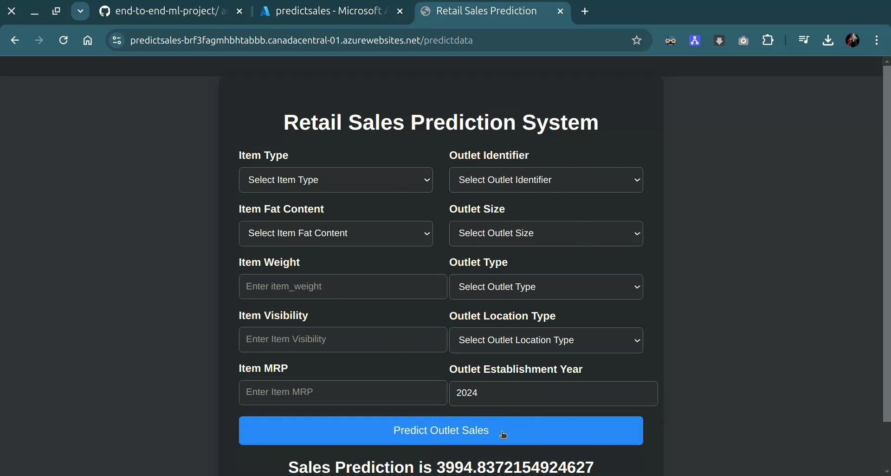
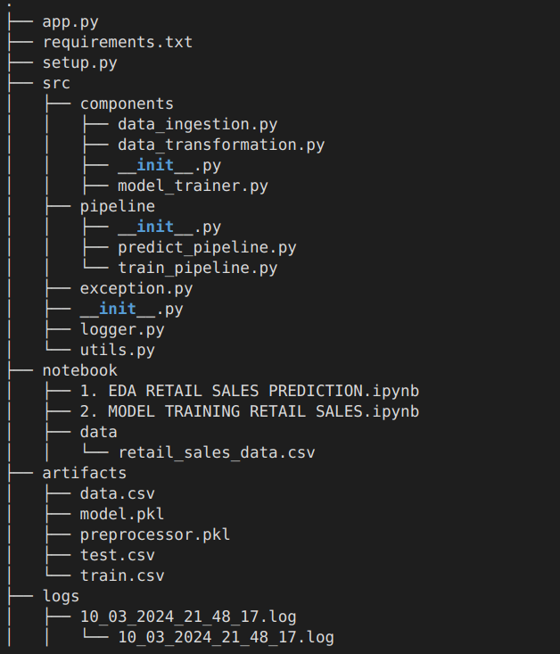

# End-to-End ML Project for RETAIL SALES PREDICTION

- This project is an End-to-End ML solution integrated with a Flask Web App to provide real-time predictions of ITEM OUTLET SALES for RETAIL BUSINESSES.
- The prediction is based on various input features, including item attributes (such as weight, visibility, and MRP), and outlet characteristics (such as outlet type, size, location, and year of establishment).
- It features a modular code structure that automates the entire Training Pipeline, including data ingestion, data transformation, model training, hyperparameter tuning, and model evaluation.
- The Prediction Pipeline is optimized for seamless user interaction through the web app. 
- Additionally, GitHub Actions are used to automate the deployment process to Azure Web Apps, enabling efficient and scalable production-level deployment without manual intervention. 
- This setup ensures an effective, robust solution for real-time ML applications.

## Technologies Used

- **Programming Language**: Python
- **Data Manipulation**: Pandas, NumPy, Matplotlib
- **Machine Learning Libraries**: Scikit-Learn, CatBoost, XGBoost
- **Regression Models**: Linear Regression, Decision Tree Regressor, Random Forest Regressor, Gradient Boosting 
- **Web Framework**: Flask
- **Deployment**: Azure Web Apps, GitHub Actions

## Key Strengths of the Project:
- End-to-End Machine Learning Pipeline
- Modular Code Structure
- Automated Training and Prediction Pipelines
- Production-Ready Machine Learning Code
- Model Evaluation and Hyperparameter Tuning
- Robust Error Handling with Custom Exceptions
- Flask Web Application Interface
- Utilization of GitHub Actions for Deployment
- Scalable and Maintainable Architecture

## ML Project Structure:
